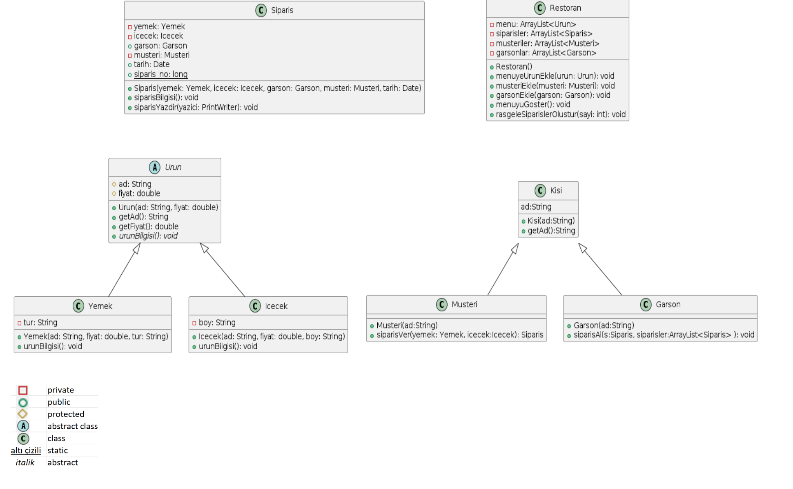

# Nesne Yönelimli Programlama Proje Ödevi
## Proje Konusu
 Proje konusu olarak restoran similatör uygulaması istenmektedir. 
 Söz konusu similatörde 'Bir restoranda, garsonlar, müşteriler ve restoranda satılan ürünleri (yemek veya içecek) içeren bir menü bulunmaktadır. Bir müşteri, restorana
geldiğinde menüden sadece yemek, sadece içecek veya yemek&içecek seçebilmektedir. Bu seçiminden sonra rasgele bir garsonu çağırıp
siparişini garsona iletmektedir. Garson siparişi aldıktan sonra bu siparişin içeriğini hem konsola yazdırmakta hem de Java projenizle aynı dizinde
otomatik olarak yaratacağınız (kod yardımıyla) “Siparisler” isimli bir klasörün içinde açtığı “siparis_numara.txt” isimli bir dosyaya
yazdırmaktadır (Bu işi Garson nesnesi yapmaktadır). Dosya ismindeki numara ifadesi siparişin sırasını ifade eden bir sayıdır. '
Kurallarına ve aşağıda gösterilen uml diyagramına uygun olarak bir proje geliştirilecektir.

## UML Diyagramı


## Proje Geliştirme Aşamaları
1. Proje için gerekli sınıflar oluşturuldu.
2. Sınıflar arasındaki ilişkiler uml diyagramına uygun olarak oluşturuldu.
3. Sınıfların özellikleri ve metodları oluşturuldu.
4. Sınıf methodları gerçekleştirildi.
5. Proje test edildi.

-----------------
## Kisi Sınıfı
Ata sınıf olarak Müsteri ve garson sınıflarında kullanılmak üzere oluşturulmuştur.\
- **özellikleri:**

    - **Ad**: String getAd() methodu var olduğu için private kabul edild.

- **metodları:**

    - **Kisi(String ad)**: constructor metod olup *ad* parametresi alır.
    - **getAd()**: *string* tipinde ad özelliğini döndürür.

-----------------
## Musteri Sınıfı
Kisi sınıfından türetilmiştir.\
- **özellikleri:**
    - *Yok*
    
- **metodları:**

    - **Müsteri(String ad)**: constructor metod olup *ad* parametresi alır.
    - **sparisVer(Yemek, Icecek)**: *Yemek* ve *Icecek* objelerini referans alır ve   *Sparis* objesi döndürür.

-----------------
## Garson Sınıfı
Kisi sınıfından türetilmiştir.\
- **özellikleri:**
    - *Yok*
- **metodları:**

    - **Garson(String ad)**: constructor metod olup *ad* parametresi alır.
    - **siparisAl(Sparis, ArrayList<Siparis>)**: *Sparis* objesini ve *Siparis* listesini referans alır ve *Siparis* listesine ekler. 
    Ayrıca Siparis bilgisini konsola ve dosyaya yazar.


-----------------
## Urun Sınıfı
Ata sınıf olarak Yemek ve Icecek sınıflarında kullanılmak üzere oluşturulmuştur.\
- **özellikleri:**
    - **ad**: *String* *protected* olarak tanımlandı.
    - **fiyat**: *double* *protected* olarak tanımlandı.

- **metodları:**
    
    - **Urun(String ad, double fiyat)**: constructor metod olup *ad* ve *fiyat* parametreleri alır.
        
    - **getAd()**: *String* tipinde ad özelliğini döndürür.
    - **getFiyat()**: *double* tipinde fiyat özelliğini döndürür.   
    - **urunBilgisi()**: void tipinde *abstract* metoddur. Yemek ve Icecek sınıflarında override edilir.


-----------------
## Yemek Sınıfı
Urun sınıfından türetilmiştir.\
- **özellikleri:**
    - *Tur*: *String* tipinde *private* olarak tanımlandı.

- **metodları:**
    
    - **Yemek(String ad, double fiyat, String tur)**: constructor metod olup *ad*, *fiyat* ve *tur* parametreleri alır.
    - **urunBilgisi()**: void tipinde *abstract* metoddur. Urun sınıfından override edilir.

-----------------
## Icecek Sınıfı
Urun sınıfından türetilmiştir.\
- **özellikleri:**
    - *boy*: *String* tipinde *private* olarak tanımlandı.

- **metodları:**
    - **Icecek(String ad, double fiyat, String boyut)**: constructor metod olup *ad*, *fiyat* ve *boyut* parametreleri alır.
    - **urunBilgisi()**: void tipinde *abstract* metoddur. Urun sınıfından override edilir.

-----------------

## Siparis Sınıfı
Siparis sınıfı oluşturuldu.\
- **özellikleri:**
    - **musteri**: *Musteri* tipinde *private* olarak tanımlandı.
    - **yemek**: *Yemek* tipinde *private* olarak tanımlandı.
    - **icecek**: *Icecek* tipinde *private* olarak tanımlandı.
    - **siparisNo**: *int* tipinde *static* *public* olarak tanımlandı.
    - **tarih**: *Date* tipinde *private* olarak tanımlandı.
    - **garson**: *Garson* tipinde *public* olarak tanımlandı.
- **metodları:**
    - **Siparis(Yemek yemek, Icecek icecek, Garson garson,Musteri musteri,Date tarih)**: constructor metod olup *yemek*, *icecek*, *garson*, *musteri* ve *tarih* parametreleri alır.
    - **SiparisBilgisi()**: void tipinde siparis bilgisini konsola yazar.
    - **siparisYazdir()**: void tipinde siparis bilgisini dosyaya yazar.

-----------------
## Restoran Sınıfı
Restoran sınıfı oluşturuldu.\
- **özellikleri:**
    - **siparisler**: *ArrayList<Siparis>* tipinde *private* olarak tanımlandı.
    - **garsonlar**: *ArrayList<Garson>* tipinde *private* olarak tanımlandı.
    - **musteriler**: *ArrayList<Musteri>* tipinde *private* olarak tanımlandı. 
    - **menu**: *ArrayList<Urun>* tipinde *private* olarak tanımlandı. Yemek ve Icecek objelerini içerir.
- **metodları:**
    - **Restoran()**: constructor metod olup *menu*, *garsonlar*, *musteriler* ve *siparisler* listelerini oluşturur.
    - **menuGoster()**: void tipinde menüyü konsola yazar.
    - **garsonEkle(Garson garson)**: void tipinde *garsonlar* listesine *garson* ekler.
    - **musteriEkle(Musteri musteri)**: void tipinde *musteriler* listesine *musteri* ekler.
    - **rasgeleSiparislerOlustur(int adet)**: void tipinde *adet* kadar rasgele sipariş oluşturur.

-----------------
## Test Sınıfı
Restoran sınıfı test edildi.\
- **metodları:**
    - **main(String[] args)**: Restoran sınıfı test edildi.

-----------------

### TEST

Aşapıdaki kodlar Test sınıfında kullanılmıştır. ve bu girdi örneklerine ait çıktılar aşağıda verilmiştir.

```java
package nyp_proje_odevi;

public class Test 
{
    public static void main( String[] args )
    {
        Restoran restoran = new Restoran(); // Restoran nesnesi oluşturuldu.
        restoran.menuyeUrunEkle(new Yemek("Köfte", 200, "Kırmızı Et"));
        restoran.menuyeUrunEkle(new Yemek("Tavuk", 150, "Beyaz Et"));
        restoran.menuyeUrunEkle(new Yemek("Pilav", 50, "Yan Yemek"));
        restoran.menuyeUrunEkle(new Yemek("Çorba", 80, "Başlangıç"));
        restoran.menuyeUrunEkle(new Yemek("Kuru Fasulye", 100, "Sulu Yemek"));

        restoran.menuyeUrunEkle(new Icecek("Su", 10, "Pet"));
        restoran.menuyeUrunEkle(new Icecek("Kola", 30,  "Şişe"));
        restoran.menuyeUrunEkle(new Icecek("Çay", 15, "Fincan"));
        restoran.menuyeUrunEkle(new Icecek("Kahve", 50, "Fincan"));
        restoran.menuyeUrunEkle(new Icecek("Limonata", 80, "Bardak"));
        restoran.menuyuGoster();
        

        restoran.garsonEkle(new Garson("Ali"));
        restoran.garsonEkle(new Garson("Veli"));
        restoran.garsonEkle(new Garson("Ayşe"));
        restoran.garsonEkle(new Garson("Fatma"));

        restoran.musteriEkle(new Musteri("Ahmet"));
        restoran.musteriEkle(new Musteri("Mehmet"));
        restoran.musteriEkle(new Musteri("Ayşe"));
        restoran.musteriEkle(new Musteri("Fatma"));

        restoran.rasgeleSiparislerOlustur(10);
        
    }
}
```


## Console Çıktısı

* menuGoster() metodu çağrıldı.

``` output
    ----MENÜ----
    Yemek Adı : Köfte
    Fiyatı: 200.0
    Tür: Kırmızı Et
    ------------
    Yemek Adı : Tavuk
    Fiyatı: 150.0
    Tür: Beyaz Et
    ------------
    Yemek Adı : Pilav
    Fiyatı: 50.0
    Tür: Yan Yemek
    ------------
    Yemek Adı : Çorba
    Fiyatı: 80.0
    Tür: Başlangıç
    ------------
    Yemek Adı : Kuru Fasulye
    Fiyatı: 100.0
    Tür: Sulu Yemek
    ------------
    İçecek Adı: Su
    Fiyat: 10.0
    Boyut:Pet
    ------------
    İçecek Adı: Kola
    Fiyat: 30.0
    Boyut:Şişe
    ------------
    İçecek Adı: Çay
    Fiyat: 15.0
    Boyut:Fincan
    ------------
    İçecek Adı: Kahve
    Fiyat: 50.0
    Boyut:Fincan
    ------------
    İçecek Adı: Limonata
    Fiyat: 80.0
    Boyut:Bardak
    ------------
    ------------
```


* rasgeleSiparislerOlustur() metodu çağrıldı.
```
    Yemek: Bos - 0.0
    İçecek: Su - 10.0
    Garson: Veli
    Müşteri: Ahmet
    Tarih: Sat May 18 20:05:03 TRT 2024
    Siparis Alindi.


    Yemek: Çorba - 80.0
    İçecek: Su - 10.0
    Garson: Fatma
    Müşteri: Ahmet
    Tarih: Sat May 18 20:05:03 TRT 2024
    Siparis Alindi.


    Yemek: Çorba - 80.0
    İçecek: Su - 10.0
    Garson: Ali
    Müşteri: Mehmet
    Tarih: Sat May 18 20:05:03 TRT 2024
    Siparis Alindi.


    Yemek: Pilav - 50.0
    İçecek: Limonata - 80.0
    Garson: Fatma
    Müşteri: Ayşe
    Tarih: Sat May 18 20:05:03 TRT 2024
    Siparis Alindi.


    Yemek: Kuru Fasulye - 100.0
    İçecek: Kola - 30.0
    Garson: Fatma
    Müşteri: Fatma
    Tarih: Sat May 18 20:05:03 TRT 2024
    Siparis Alindi.


    Yemek: Çorba - 80.0
    İçecek: Kahve - 50.0
    Garson: Veli
    Müşteri: Ayşe
    Tarih: Sat May 18 20:05:03 TRT 2024
    Siparis Alindi.


    Yemek: Köfte - 200.0
    İçecek: Limonata - 80.0
    Garson: Fatma
    Müşteri: Fatma
    Tarih: Sat May 18 20:05:03 TRT 2024
    Siparis Alindi.


    Yemek: Köfte - 200.0
    İçecek: Limonata - 80.0
    Garson: Ayşe
    Müşteri: Fatma
    Tarih: Sat May 18 20:05:03 TRT 2024
    Siparis Alindi.


    Yemek: Kuru Fasulye - 100.0
    İçecek: Kola - 30.0
    Garson: Veli
    Müşteri: Ahmet
    Tarih: Sat May 18 20:05:03 TRT 2024
    Siparis Alindi.


    Yemek: Çorba - 80.0
    İçecek: Çay - 15.0
    Garson: Fatma
    Müşteri: Fatma
    Tarih: Sat May 18 20:05:03 TRT 2024
    Siparis Alindi.
```

## Dosya Çıktısı

* bash tree komutu ile dosya yapısı aşağıdaki gibi olacaktır.
``` bash tree
─ Readme.md
├── Siparisler
│   ├── siparis_1.txt
│   ├── siparis_10.txt
│   ├── siparis_2.txt
│   ├── siparis_3.txt
│   ├── siparis_4.txt
│   ├── siparis_5.txt
│   ├── siparis_6.txt
│   ├── siparis_7.txt
│   ├── siparis_8.txt
│   └── siparis_9.txt
├── docs
│   └── ***
├── pom.xml
├── src
***
```

## Örnek Dosya Çıktısı (siparis_1.txt):
```
    Yemek: Bos - 0.0
    İçecek: Su - 10.0
    Garson: Veli
    Müşteri: Ahmet
    Tarih: Sat May 18 20:05:03 TRT 2024
    Siparis Alindi.
```